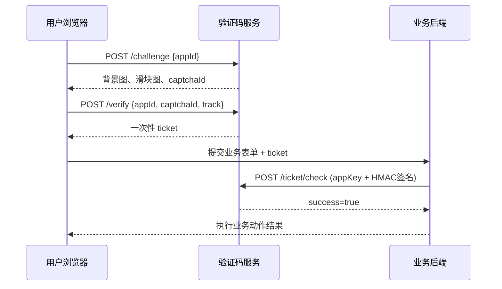

# Waterproof Wall · 滑动验证码平台

自托管多租户滑动验证码平台，HMAC 签名验票，一行代码接入。

## 特性

- **多租户隔离** — 每个应用独立 `appId` / `appKey` / `appSecret`
- **HMAC-SHA256 签名验票** — 防伪造、防重放
- **App Secret 加密存储** — AES-GCM 加密，仅创建/重置时明文返回一次
- **行为轨迹分析** — 滑动速度、加速度、Y 轴偏移、步长分布等多维度区分人机
- **纯 Go 生成图片** — 不依赖外部字体，渐变背景 + 随机噪点
- **IP 限流** — 按 IP + 应用 + 场景滑动窗口限流
- **用量统计** — 按日统计挑战/验证/通过/失败/验票数
- **多实例部署** — 支持 Redis 共享票据存储
- **Vue 3 + Vite 前端** — SPA 控制台，暗色主题

## 项目结构

```
.
├── cmd/
│   ├── api/main.go       # API 服务入口（Go），监听 :8088
│   └── web/              # 前端构建输出（npm run build 生成）
├── src/                  # 前端源码（Vue 3 + Vite）
│   ├── src/
│   │   ├── views/        # 页面：Home / Dashboard / Example / Docs / Source
│   │   ├── components/   # 组件：AuthModal / CreateAppModal / SecretModal ...
│   │   ├── composables/  # useApi / useAuth / useToast
│   │   ├── router.js     # Vue Router（/dashboard 需要登录）
│   │   └── style.css     # 暗色主题全局样式
│   ├── public/sdk/       # JS SDK 源文件（captcha.js / captcha.src.js）
│   └── .env.example      # 环境变量示例
├── internal/             # Go 后端代码
│   ├── captcha/          # 验证码图片生成 + 行为分析
│   ├── config/           # 配置加载（YAML + 环境变量覆盖）
│   ├── http/             # HTTP 路由 + 处理器 + CORS + 限流
│   ├── model/            # 数据模型
│   ├── platform/         # 用户/应用管理 + AES-GCM 加密 + MySQL/内存存储
│   ├── secure/           # crypto/rand 安全随机数
│   ├── store/            # 挑战/票据存储（Redis / 内存）
│   └── ticket/           # 票据签发与校验（HMAC-SHA256）
├── deploy/               # 部署配置
│   ├── nginx.conf        # Nginx 反向代理（/api/ → :8088）
│   └── 007.service       # systemd 服务文件
├── docs/
│   └── API_AND_JSSDK.md  # API + SDK 完整接入文档
├── config.example.yml    # 配置文件模板
├── deploy.sh             # 构建 + 上传腾讯云 COS
├── go.mod
└── go.sum
```

## 快速开始

### 1. 配置

```bash
cp config.example.yml config.yml
# 编辑 config.yml，修改 secret、db.password 等
```

敏感参数支持 `CAPTCHA_` 前缀环境变量覆盖：

| 环境变量 | 默认值 / 说明 |
|---------|-------------|
| `CAPTCHA_SECRET` | HMAC 签名密钥（生产必须替换，≥32 字节） |
| `CAPTCHA_ADDR` | 监听地址，默认 `:8088` |
| `CAPTCHA_STORE` | `memory` 或 `redis` |
| `CAPTCHA_PLATFORM_STORE` | `memory` 或 `mysql` |
| `CAPTCHA_DB_PASSWORD` | MySQL 密码 |
| `CAPTCHA_REDIS_ADDR` | Redis 地址 |

全部配置项见 `config.example.yml`。

### 2. 启动 API

```bash
go run ./cmd/api/ -c config.yml
```

API 默认监听 `:8088`，启动日志：`captcha api listening on :8088 (store=memory platform=mysql)`

### 3. 前端开发

```bash
cd src
npm install
npm run dev      # 访问 http://localhost:5173，API 自动代理到 :8088
```

### 4. 前端构建

```bash
cd src
npm run build    # 输出到 ../cmd/web/
```

构建时通过 `VITE_APP_DOMAIN` 替换域名占位符：

| 环境变量 | 默认值 |
|---------|-------|
| `VITE_APP_DOMAIN` | `https://007.hallo.run` |
| `VITE_APP_API_BASE` | `https://007.hallo.run` |

开发环境（`.env.develop`）：`VITE_APP_DOMAIN=http://127.0.0.1:5173`，`VITE_APP_API_BASE` 为空（走 Vite 代理）。

## HTTP API

### 平台管理（Bearer Token 认证）

| 方法 | 路径 | 说明 |
|------|------|------|
| `POST` | `/api/v1/users/register` | 用户注册（无需认证） |
| `POST` | `/api/v1/users/login` | 用户登录（无需认证） |
| `GET` | `/api/v1/users/me` | 获取当前用户 |
| `GET` | `/api/v1/apps` | 列出应用 |
| `POST` | `/api/v1/apps` | 创建应用 |
| `POST` | `/api/v1/apps/rotate-secret` | 重置 App Secret |
| `POST` | `/api/v1/apps/update-domains` | 更新域名白名单 |
| `GET` | `/api/v1/apps/usage?date=&appId=` | 用量统计 |

### 验证码

| 方法 | 路径 | 说明 | 认证 |
|------|------|------|------|
| `POST` | `/api/v1/challenge` | 生成挑战（返回背景图 + 滑块图） | appId |
| `POST` | `/api/v1/verify` | 提交验证（轨迹分析 + 签发票据） | appId |
| `POST` | `/api/v1/ticket/check` | 后端校验票据 | appKey + HMAC 签名 |

### 健康检查

| 方法 | 路径 | 说明 |
|------|------|------|
| `GET` | `/healthz` | 返回 `{"status":"ok"}` |

## 接入流程



### 前端接入

```html
<script src="https://007.hallo.run/sdk/captcha.js"></script>
<script>
const captcha = new SliderCaptcha({
  appId: 'your-app-id',
  endpoint: 'https://007.hallo.run/api'
});
captcha.verify().then(result => {
  // result.ticket 提交给业务后端校验
});
</script>
```

### 后端验票（Go）

```go
import (
    "crypto/hmac"
    "crypto/sha256"
    "encoding/base64"
)

func sign(appSecret, method, path, timestamp, nonce, body string) string {
    input := method + "\n" + path + "\n" + timestamp + "\n" + nonce + "\n" + body
    mac := hmac.New(sha256.New, []byte(appSecret))
    mac.Write([]byte(input))
    return base64.RawURLEncoding.EncodeToString(mac.Sum(nil))
}

// 请求头:
// X-Captcha-App-Key: {appKey}
// X-Captcha-Timestamp: {current_ts}
// X-Captcha-Nonce: {random_nonce}
// X-Captcha-Signature: {signature}
```

签名字符串格式：`{METHOD}\n{path}\n{timestamp}\n{nonce}\n{body}`

### 后端验票（Node.js）

```js
const crypto = require('crypto');

function sign(appSecret, method, path, ts, nonce, body) {
  const input = [method, path, ts, nonce, body].join('\n');
  return crypto.createHmac('sha256', appSecret).update(input).digest('base64url');
}
```

## 数据库

MySQL 自动建表（`platform_store: mysql` 时），共 3 张表：

| 表 | 说明 |
|----|------|
| `users` | 注册用户（邮箱 + 密码哈希） |
| `apps` | 应用（appKey / secret_cipher / domains） |
| `captcha_events` | 验证事件日志（聚合用量统计） |

appSecret 使用 AES-GCM 加密存储，加密密钥由 `secret` 配置衍生。

## 生产部署

### 交叉编译（Linux amd64）

```bash
GOOS=linux GOARCH=amd64 CGO_ENABLED=0 go build -o captcha-api ./cmd/api/
```

### 部署文件

| 文件 | 目标路径 | 说明 |
|------|---------|------|
| `captcha-api` | `/opt/007/captcha-api` | API 二进制 |
| `cmd/web/` | `/opt/007/web/` | 前端静态文件 |
| `config.yml` | `/opt/007/config.yml` | 配置文件 |
| `deploy/nginx.conf` | `/etc/nginx/conf.d/007.hallo.run.conf` | Nginx 配置 |
| `deploy/007.service` | `/etc/systemd/system/007.service` | systemd 服务 |

### 启动服务

```bash
sudo systemctl enable 007
sudo systemctl start 007
sudo nginx -t && sudo systemctl reload nginx
```

### Nginx 路由

- `/api/` → 反向代理 `127.0.0.1:8088`
- 其他路径 → SPA 静态文件（`try_files` 回退 `index.html`）
- SDK：`/sdk/captcha.js`

### 多实例部署

设置 `store: redis`，多个 API 实例共享 Redis 中的挑战/票据数据，实现水平扩展。

## 安全建议

- `config.yml` 不入版本库（已在 `.gitignore`）
- 生产环境**必须替换** `secret` 为 ≥32 字节随机密钥
- `appSecret` 只保管在业务后端，**绝不泄露到前端**
- `/api/v1/ticket/check` 建议网关层限制仅允许业务后端 IP 访问
- 票据校验成功后**立即执行业务**，不要缓存验票结果
- 多实例部署使用 `store: redis` 共享票据存储

## 许可

本项目基于 [MIT](LICENSE) 协议开源，保留署名权，不得移除或修改原作者署名。
