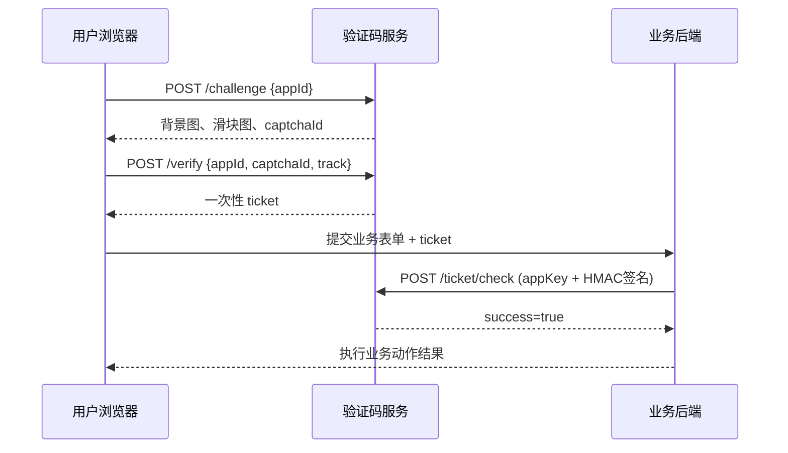

# 滑动验证码平台 API 与 JS SDK 接入文档

本文档面向业务前端、业务后端和验证码服务部署方，描述多租户验证码平台的 HTTP API、浏览器 JS SDK、HMAC 签名验票流程和生产配置。

## 1. 接入流程

### 平台模式（推荐）



核心约束：

- `ticket` 只应由前端提交给业务后端。
- `/api/v1/ticket/check` 只应由业务后端调用，使用 appKey + appSecret HMAC 签名。
- `ticket` 一次性消费，校验成功后再次提交会失败。
- 业务后端不要自行解析票据后直接放行，必须调用验证码服务验票。
- **appSecret 只保管在业务后端**，不会在网络中传输。

### 单机模式

不启用平台数据库时，验票接口使用 API Key 认证：

```http
Authorization: Bearer <api-key>
```

或：

```http
X-Captcha-Key: <api-key>
```

## 2. 服务地址

本地开发默认地址：

```text
http://localhost:8088
```

| 路径 | 说明 |
| --- | --- |
| `/admin` | 管理后台 |
| `/example/` | 接入示例页 |
| `/sdk/captcha.js` | JS SDK |

生产环境建议使用独立域名，例如 `https://captcha.example.com`。

## 3. API 通用约定

请求与响应均为 JSON：

```http
Content-Type: application/json
```

### 通用错误响应

```json
{
  "success": false,
  "error": "invalid_json"
}
```

| HTTP 状态码 | 含义 |
| --- | --- |
| `200` | 请求成功，业务结果看 `success` |
| `400` | 请求参数、挑战状态或上下文不合法 |
| `401` | 票据无效、签名错误、API Key 缺失 |
| `403` | 来源域名不被允许、应用已禁用 |
| `429` | 限流或挑战尝试次数过多 |
| `500` | 服务内部错误 |
| `503` | 平台功能未启用 |

## 4. 平台管理接口

### 4.1 用户注册

```http
POST /api/v1/users/register
Content-Type: application/json

{"email": "user@example.com", "password": "at-least-8-chars"}
```

成功响应：

```json
{
  "success": true,
  "token": "eyJ1aWQiOi...",
  "user": {"id": "usr_xxx", "email": "user@example.com", "createdAt": "..."}
}
```

错误：

| error | 说明 |
| --- | --- |
| `invalid_user` | 邮箱格式错误或密码不足 8 位 |
| `user_exists` | 邮箱已注册 |

### 4.2 用户登录

```http
POST /api/v1/users/login
Content-Type: application/json

{"email": "user@example.com", "password": "at-least-8-chars"}
```

成功响应同注册。

### 4.3 创建应用

```http
POST /api/v1/apps
Content-Type: application/json
Authorization: Bearer <token>

{"name": "官网登录页", "domains": ["example.com", "www.example.com"]}
```

成功响应（**appSecret 仅此一次返回**）：

```json
{
  "success": true,
  "app": {
    "appId": "app_xxx",
    "name": "官网登录页",
    "appKey": "key_xxx",
    "appSecret": "sec_xxx",
    "domains": ["example.com", "www.example.com"],
    "status": "active",
    "createdAt": "..."
  }
}
```

### 4.4 列出应用

```http
GET /api/v1/apps
Authorization: Bearer <token>
```

响应中不含 appSecret。

### 4.5 重置 Secret

```http
POST /api/v1/apps/rotate-secret
Content-Type: application/json
Authorization: Bearer <token>

{"appId": "app_xxx"}
```

成功后返回新的 appSecret（**仅此一次返回**），旧 Secret 立即失效。

### 4.6 调用统计

```http
GET /api/v1/apps/usage?date=2026-05-26&appId=app_xxx
Authorization: Bearer <token>
```

参数说明：

| 参数 | 必填 | 说明 |
| --- | --- | --- |
| `date` | 否 | 日期，默认当天，格式 `YYYY-MM-DD` |
| `appId` | 否 | 指定应用，不填则返回所有应用的汇总 |

响应：

```json
{
  "success": true,
  "date": "2026-05-26",
  "apps": [
    {
      "app": {"appId": "app_xxx", "name": "...", ...},
      "daily": {
        "AppID": "app_xxx",
        "Date": "2026-05-26",
        "Challenges": 150,
        "Verifies": 0,
        "Passes": 132,
        "Fails": 18,
        "Tickets": 128
      }
    }
  ]
}
```

## 5. 生成挑战

```http
POST /api/v1/challenge
Content-Type: application/json
```

### 请求参数

```json
{
  "appId": "app_xxx",
  "scene": "login",
  "bizId": "user-123"
}
```

| 字段 | 类型 | 必填 | 说明 |
| --- | --- | --- | --- |
| `appId` | string | 平台模式必填 | 应用 ID |
| `scene` | string | 否 | 业务场景，空值使用 `default` |
| `bizId` | string | 否 | 业务标识 |

### 成功响应

```json
{
  "captchaId": "eY8_RASZ98QWh7Q8YuGKnf8bO5IQ2E3P",
  "background": "data:image/png;base64,...",
  "piece": "data:image/png;base64,...",
  "pieceY": 48,
  "width": 320,
  "height": 160,
  "pieceSize": 58,
  "expiresIn": 120
}
```

### 可能错误

| error | 说明 |
| --- | --- |
| `missing_app_id` | 平台模式未提供 appId |
| `app_not_found` | 应用不存在 |
| `app_disabled` | 应用已禁用 |
| `origin_not_allowed` | 请求来源不在应用允许域名列表 |
| `rate_limited` | IP + 应用 + 场景限流 |

## 6. 前端滑动验证

```http
POST /api/v1/verify
Content-Type: application/json
```

### 请求参数

```json
{
  "appId": "app_xxx",
  "captchaId": "eY8_RASZ98QWh7Q8YuGKnf8bO5IQ2E3P",
  "scene": "login",
  "bizId": "user-123",
  "x": 124,
  "track": [
    {"x": 0, "y": 0, "t": 0},
    {"x": 6, "y": 1, "t": 52},
    {"x": 124, "y": 0, "t": 920}
  ]
}
```

| 字段 | 类型 | 必填 | 说明 |
| --- | --- | --- | --- |
| `appId` | string | 平台模式必填 | 必须与挑战时一致 |
| `captchaId` | string | 是 | 挑战 ID |
| `scene` | string | 否 | 必须与挑战时一致 |
| `bizId` | string | 否 | 必须与挑战时一致 |
| `x` | number | 是 | 滑块最终 X 坐标 |
| `track` | array | 是 | 滑动轨迹点 |

### 成功响应

```json
{
  "success": true,
  "ticket": "eyJhbGciOiJIUzI1NiIsInR5cCI6ImNhcHRjaGEtdGlja2V0In0...",
  "expiresIn": 180,
  "score": 0.86
}
```

### 未通过响应

```json
{
  "success": false,
  "reason": "bot_like_track",
  "score": 0.42
}
```

常见 `reason`：

| reason | 说明 |
| --- | --- |
| `track_too_short` | 轨迹点过少 |
| `position_mismatch` | 滑块位置偏差过大 |
| `too_fast` | 滑动耗时过短 |
| `too_slow` | 滑动耗时过长 |
| `final_x_mismatch` | 轨迹终点与提交坐标不一致 |
| `invalid_time` | 轨迹时间不递增 |
| `bot_like_track` | 轨迹特征偏脚本化 |

## 7. 业务后端校验票据（平台模式）

平台模式使用 HMAC-SHA256 签名认证，appSecret 不在网络中传输。

### 签名算法

```
signingInput = HTTP_METHOD + "\n" + REQUEST_PATH + "\n" + TIMESTAMP + "\n" + NONCE + "\n" + REQUEST_BODY
signature = Base64URL(HMAC-SHA256(appSecret, signingInput))
```

### 请求示例

```http
POST /api/v1/ticket/check
Content-Type: application/json
X-Captcha-App-Key: key_xxx
X-Captcha-Timestamp: 1780000000
X-Captcha-Nonce: a1b2c3d4e5f6
X-Captcha-Signature: Base64URL编码的HMAC-SHA256签名

{"appId": "app_xxx", "ticket": "...", "scene": "login", "bizId": "user-123"}
```

| Header | 说明 |
| --- | --- |
| `X-Captcha-App-Key` | 应用的 appKey |
| `X-Captcha-Timestamp` | 当前 Unix 时间戳（秒） |
| `X-Captcha-Nonce` | 随机字符串，防重放 |
| `X-Captcha-Signature` | HMAC-SHA256 签名 |

### 请求体参数

| 字段 | 类型 | 必填 | 说明 |
| --- | --- | --- | --- |
| `appId` | string | 是 | 应用 ID |
| `ticket` | string | 是 | 前端获取的一次性票据 |
| `scene` | string | 否 | 必须与挑战时一致 |
| `bizId` | string | 否 | 必须与挑战时一致 |

### 成功响应

```json
{
  "success": true,
  "appId": "app_xxx",
  "captchaId": "eY8_RASZ98QWh7Q8YuGKnf8bO5IQ2E3P",
  "scene": "login",
  "bizId": "user-123",
  "issuedAt": 1780000000,
  "expiresAt": 1780000180
}
```

### 可能错误

| error | 说明 |
| --- | --- |
| `missing_app_key` | 缺少 X-Captcha-App-Key 头 |
| `app_not_found` | appKey 对应的应用不存在 |
| `app_disabled` | 应用已禁用 |
| `invalid_signature` | HMAC 签名验证失败 |
| `app_key_mismatch` | appKey 和 appId 不匹配 |
| `invalid_ticket` | 票据格式错误、签名错误或已过期 |
| `ticket_context_mismatch` | appId / scene / bizId 不匹配 |
| `ticket_used` | 票据已被消费 |
| `ticket_not_found` | 票据状态不存在 |
| `ticket_record_mismatch` | 票据内容与服务端记录不一致 |

### JavaScript 签名实现

```js
async function hmacSign(secret, message) {
  const enc = new TextEncoder();
  const key = await crypto.subtle.importKey(
    "raw", enc.encode(secret),
    { name: "HMAC", hash: "SHA-256" }, false, ["sign"]
  );
  const sig = await crypto.subtle.sign("HMAC", key, enc.encode(message));
  return btoa(String.fromCharCode(...new Uint8Array(sig)))
    .replace(/\+/g, "-").replace(/\//g, "_").replace(/=+$/, "");
}
```

## 8. 业务后端校验票据（单机模式）

单机模式使用 API Key 认证，适用于不启用平台数据库的简单部署。

```http
POST /api/v1/ticket/check
Content-Type: application/json
Authorization: Bearer business-server-key

{"ticket": "...", "scene": "login", "bizId": "user-123"}
```

或：

```http
X-Captcha-Key: business-server-key
```

## 9. JS SDK

```html
<script src="https://captcha.example.com/sdk/captcha.js"></script>
<script>
const captcha = new SliderCaptcha({
  endpoint: "https://captcha.example.com",
  appId: "app_xxx",
  scene: "login",
  bizId: "user-123",
  timeout: 10000
});

const result = await captcha.verify();
// result.ticket 提交给业务后端
</script>
```

构造参数：

| 参数 | 类型 | 默认值 | 说明 |
| --- | --- | --- | --- |
| `endpoint` | string | `""` | 验证码服务地址，同源可留空 |
| `appId` | string | `""` | 平台模式必填，应用 ID |
| `scene` | string | `default` | 业务场景 |
| `bizId` | string | `""` | 业务标识 |
| `timeout` | number | `10000` | 弹窗超时毫秒数 |

`verify()` 返回值：

```json
{
  "success": true,
  "ticket": "...",
  "expiresIn": 180,
  "score": 0.86
}
```

异常：

| message | 说明 |
| --- | --- |
| `captcha challenge failed` | 创建挑战失败 |
| `captcha cancelled` | 用户关闭弹窗 |
| `captcha timeout` | 弹窗超时 |

### 表单集成示例

```html
<form id="loginForm">
  <input name="username" autocomplete="username">
  <input name="password" type="password" autocomplete="current-password">
  <button type="submit">登录</button>
</form>

<script src="https://captcha.example.com/sdk/captcha.js"></script>
<script>
document.getElementById("loginForm").addEventListener("submit", async (event) => {
  event.preventDefault();

  const form = event.currentTarget;
  const username = form.username.value;

  const captcha = new SliderCaptcha({
    endpoint: "https://captcha.example.com",
    appId: "app_xxx",
    scene: "login",
    bizId: username
  });

  const result = await captcha.verify();

  // 将 ticket 提交给业务后端
  await fetch("/api/login", {
    method: "POST",
    headers: {"Content-Type": "application/json"},
    body: JSON.stringify({
      username,
      password: form.password.value,
      captchaTicket: result.ticket
    })
  });
});
</script>
```

## 10. 业务后端验票示例

### Go（HMAC 签名）

```go
package main

import (
	"bytes"
	"crypto/hmac"
	"crypto/sha256"
	"encoding/base64"
	"encoding/json"
	"fmt"
	"net/http"
	"strconv"
	"strings"
	"time"
)

func checkCaptcha(appKey, appSecret, ticket string) error {
	body, _ := json.Marshal(map[string]string{
		"appId":  "app_xxx",
		"ticket": ticket,
		"scene":  "login",
		"bizId":  "user-123",
	})

	ts := strconv.FormatInt(time.Now().Unix(), 10)
	nonce := "random-nonce-value"
	signingInput := strings.Join([]string{"POST", "/api/v1/ticket/check", ts, nonce, string(body)}, "\n")

	mac := hmac.New(sha256.New, []byte(appSecret))
	mac.Write([]byte(signingInput))
	sig := base64.RawURLEncoding.EncodeToString(mac.Sum(nil))

	req, _ := http.NewRequest("POST", "https://captcha.example.com/api/v1/ticket/check", bytes.NewReader(body))
	req.Header.Set("Content-Type", "application/json")
	req.Header.Set("X-Captcha-App-Key", appKey)
	req.Header.Set("X-Captcha-Timestamp", ts)
	req.Header.Set("X-Captcha-Nonce", nonce)
	req.Header.Set("X-Captcha-Signature", sig)

	res, err := http.DefaultClient.Do(req)
	if err != nil {
		return err
	}
	defer res.Body.Close()

	var out struct {
		Success bool   `json:"success"`
		Error   string `json:"error"`
	}
	json.NewDecoder(res.Body).Decode(&out)
	if res.StatusCode != http.StatusOK || !out.Success {
		return fmt.Errorf("captcha check failed: %s", out.Error)
	}
	return nil
}
```

### Node.js（HMAC 签名）

```js
import { createHmac } from "crypto";

async function checkCaptcha(appKey, appSecret, ticket) {
  const body = JSON.stringify({
    appId: "app_xxx",
    ticket,
    scene: "login",
    bizId: "user-123",
  });

  const ts = Math.floor(Date.now() / 1000).toString();
  const nonce = "random-nonce-value";
  const signingInput = ["POST", "/api/v1/ticket/check", ts, nonce, body].join("\n");
  const sig = createHmac("sha256", appSecret).update(signingInput).digest("base64url");

  const res = await fetch("https://captcha.example.com/api/v1/ticket/check", {
    method: "POST",
    headers: {
      "Content-Type": "application/json",
      "X-Captcha-App-Key": appKey,
      "X-Captcha-Timestamp": ts,
      "X-Captcha-Nonce": nonce,
      "X-Captcha-Signature": sig,
    },
    body,
  });

  const data = await res.json();
  if (!res.ok || !data.success) {
    throw new Error(data.error || "captcha check failed");
  }
  return data;
}
```

## 11. 配置

配置通过 `config.yml` 文件加载，敏感参数支持环境变量覆盖（环境变量优先级高于配置文件）。

### 启动方式

```bash
# 使用默认配置文件 config.yml
go run ./cmd/captcha-server

# 指定配置文件路径
go run ./cmd/captcha-server -c /etc/captcha/config.yml

# 敏感参数通过环境变量覆盖
export CAPTCHA_SECRET="your-32-byte-random-secret"
export CAPTCHA_DB_PASSWORD="your-db-password"
go run ./cmd/captcha-server -c config.yml
```

### 配置文件示例

```yaml
addr: ":8088"
secret: "dev-secret-change-me-at-least-32-bytes"   # 生产必须替换
store: "memory"                                      # memory 或 redis
platform_store: "mysql"                              # memory 或 mysql

db:
  addr: "127.0.0.1:3306"
  user: "root"
  password: ""      # 建议通过 CAPTCHA_DB_PASSWORD 环境变量传入
  name: "waterproof_wall"

redis:
  addr: "127.0.0.1:6379"
  password: ""      # 建议通过 CAPTCHA_REDIS_PASSWORD 环境变量传入
  db: 0

allowed_origins:
  - "*"

api_keys: []        # 单机模式验票密钥

limits:
  challenge: 60     # 每 IP+应用+场景 每分钟挑战上限
  verify: 120       # 每 IP+应用+场景 每分钟验证上限

ttl:
  challenge: "2m"   # 挑战有效期
  ticket: "3m"       # 票据有效期

image:
  width: 320
  height: 160
  piece: 58
```

### 环境变量覆盖

| 环境变量 | 配置项 | 说明 |
| --- | --- | --- |
| `CAPTCHA_ADDR` | `addr` | HTTP 监听地址 |
| `CAPTCHA_SECRET` | `secret` | HMAC 签名密钥，生产必须替换 |
| `CAPTCHA_STORE` | `store` | 挑战/票据存储 |
| `CAPTCHA_PLATFORM_STORE` | `platform_store` | 平台存储 |
| `CAPTCHA_DB_ADDR` | `db.addr` | MySQL 地址 |
| `CAPTCHA_DB_USER` | `db.user` | MySQL 用户 |
| `CAPTCHA_DB_PASSWORD` | `db.password` | MySQL 密码 |
| `CAPTCHA_DB_NAME` | `db.name` | MySQL 数据库名 |
| `CAPTCHA_REDIS_ADDR` | `redis.addr` | Redis 地址 |
| `CAPTCHA_REDIS_PASSWORD` | `redis.password` | Redis 密码 |
| `CAPTCHA_REDIS_DB` | `redis.db` | Redis DB |
| `CAPTCHA_ALLOWED_ORIGINS` | `allowed_origins` | CORS 来源，逗号分隔 |
| `CAPTCHA_API_KEYS` | `api_keys` | 单机模式验票密钥，逗号分隔 |
| `CAPTCHA_CHALLENGE_LIMIT` | `limits.challenge` | 挑战限流 |
| `CAPTCHA_VERIFY_LIMIT` | `limits.verify` | 验证限流 |

详细配置参考 [config.example.yml](../config.example.yml)。

## 12. 安全建议

- **配置文件不入版本库**：`config.yml` 已在 `.gitignore` 中排除，只提交 `config.example.yml`。
- 生产环境必须替换 `secret`，建议 32 字节以上随机密钥，通过 `CAPTCHA_SECRET` 环境变量传入。
- 数据库密码、Redis 密码等敏感参数通过环境变量覆盖，不要明文写在配置文件中。
- **appSecret 只保管在业务后端**，切勿暴露到前端代码。
- `/api/v1/ticket/check` 应只允许业务后端访问，可在网关层加 IP 白名单。
- 多实例部署使用 `store: redis`，确保挑战和票据跨实例一致。
- 平台模式使用 `platform_store: mysql`，数据持久化。
- 票据校验成功后立即执行业务动作，不要长时间缓存结果。
- 重置 appSecret 后旧 Secret 立即失效，需同步更新所有业务后端。
- `bizId` 建议使用不泄露隐私的稳定标识（用户 ID、手机号 hash 等）。
- 对高风险接口叠加 IP、账号、设备维度限流。